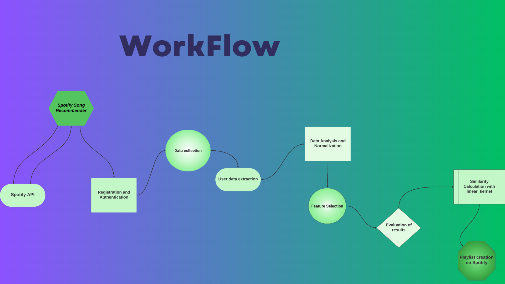

# Spotify Recommendation System

## Project Description
This Spotify Recommendation System is a Streamlit-based web application designed to generate personalized music recommendations for Spotify users. The application utilizes Spotify's API to fetch users' top tracks and then recommends new songs based on their listening preferences.

## workflow



### Requisites
- Python 3.6 or higher.
- A Spotify Developer account and a registered Spotify application to obtain the client ID and secret.

### Requirements
- spotipy
- pandas
- scikit-learn
- numpy
- joblib
- streamlit

### Steps
1. Clone the repository:
   ```
   git clone https://github.com/imfap1/Song-Recommender
   ```
2. Navigate to the project directory:
   ```
   cd spotify_recommender
   ```
3. Install the required packages:
   ```
   pip install -r requirements.txt
   ```
